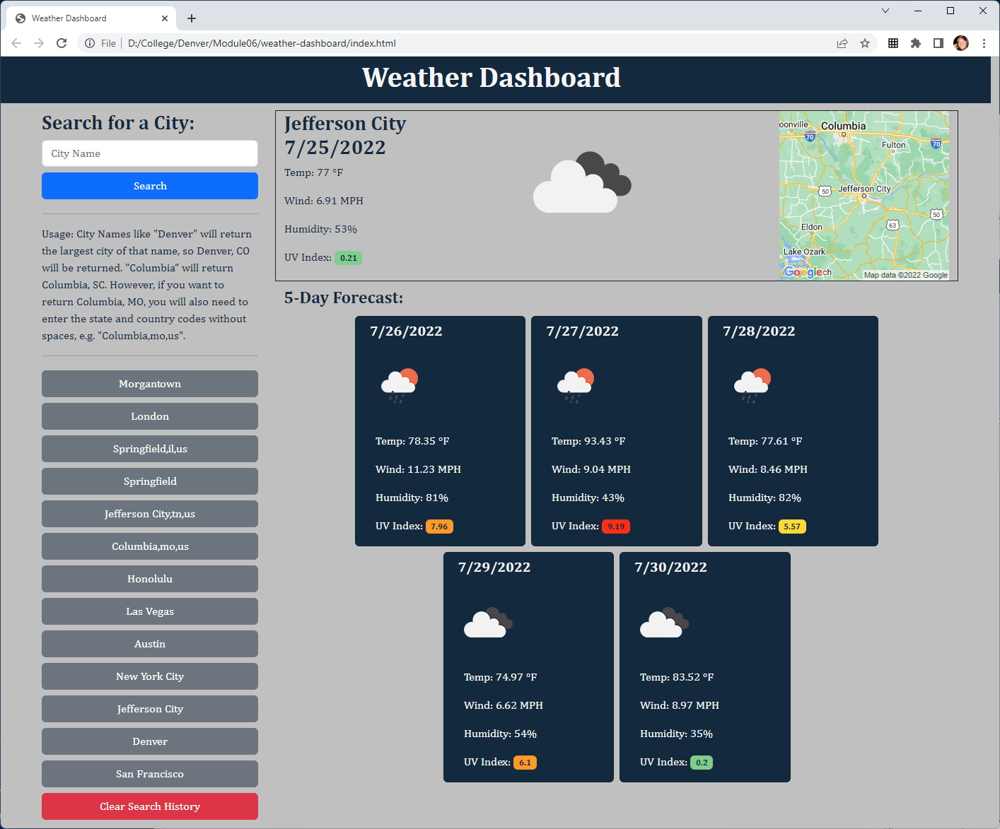

# Weather Dashboard

This project was built to satisfy the Module 06 Challenge for the University of Denver Coding Bootcamp. The purpose of this challenge is to build a weather dashboard that will run in the browser and feature dynamically updated HTML and CSS.

## Description

This is a weather dashboard application that allows a user to to search for a location's weather data.

The [OpenWeather One Call API](https://openweathermap.org/api/one-call-api) is used to retrieve weather data for cities.

The [Google Maps Static API](https://developers.google.com/maps/documentation/maps-static/overview) was used to pull up a map of the city.

### User Story

```
AS A traveler
I WANT to see the weather outlook for multiple cities
SO THAT I can plan a trip accordingly
```

### Acceptance Criteria

```
GIVEN a weather dashboard with form inputs
WHEN I search for a city
THEN I am presented with current and future conditions for that city and that city is added to the search history
WHEN I view current weather conditions for that city
THEN I am presented with the city name, the date, an icon representation of weather conditions, the temperature, the humidity, the wind speed, and the UV index
WHEN I view the UV index
THEN I am presented with a color that indicates whether the conditions are favorable, moderate, or severe
WHEN I view future weather conditions for that city
THEN I am presented with a 5-day forecast that displays the date, an icon representation of weather conditions, the temperature, the wind speed, and the humidity
WHEN I click on a city in the search history
THEN I am again presented with current and future conditions for that city
```

## Getting Started

### Dependencies

The use of a modern web browser.

### URL

- [https://dpk5e7.github.io/weather-dashboard/](https://dpk5e7.github.io/weather-dashboard/)

### Screenshots



## Authors

Dan Kelly
Daniel.Kelly@du.edu

## Version History

- 0.1
  - Initial Release

## License

This project is not licensed.

## Acknowledgments

- [Denver Coding Bootcamp](https://bootcamp.du.edu/)
- [W3Schools](https://www.w3schools.com/)
- [Mozilla Developer Network](https://developer.mozilla.org/)
- [Bootstrap](https://getbootstrap.com/)
- [OpenWeather One Call API](https://openweathermap.org/api/one-call-api)
- [EPA UV Index Guide](https://www.epa.gov/sites/default/files/documents/uviguide.pdf)
- [Google Maps Static API](https://developers.google.com/maps/documentation/maps-static/overview)
